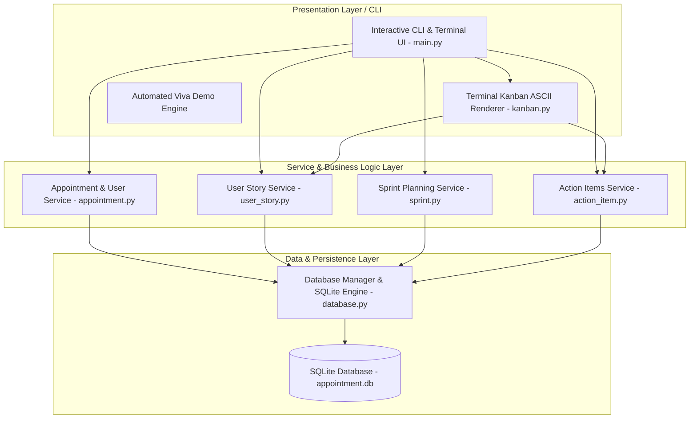
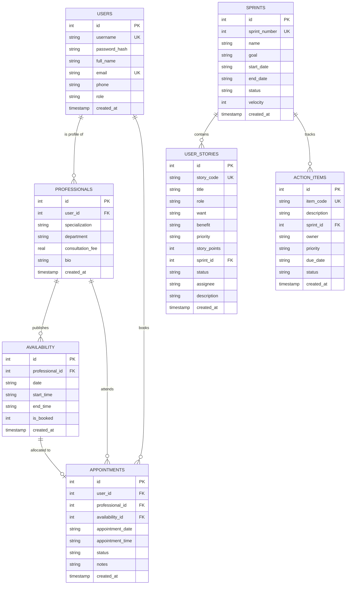
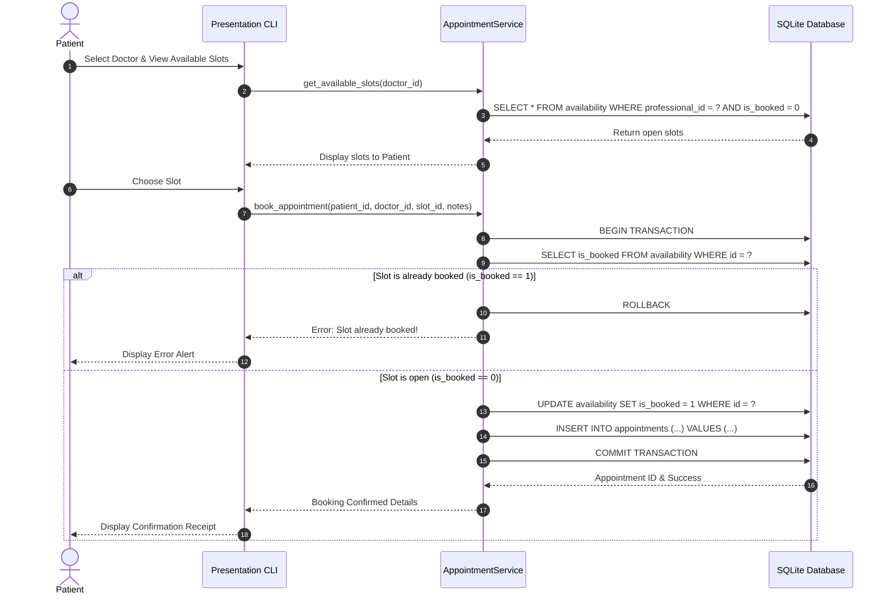
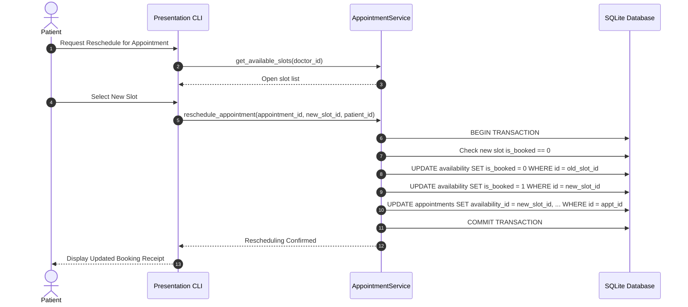
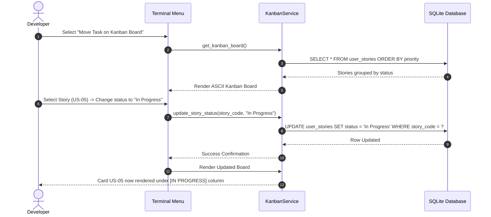

# System Design & Architecture
## Online Appointment Booking System using Scrum Agile Methodology

---

## 1. System Architecture

The project is architected following a modular **3-Tier Layered Architecture**, separating user interaction, business rules, and persistent data storage.

---

## 2. Database Design & Entity-Relationship Diagram (ERD)

The system utilizes an embedded relational database (SQLite) with strict foreign key constraints enabled.

---

## 3. Sequence Diagrams

### A. Appointment Booking & Double-Booking Lock Flow

---

### B. Rescheduling Flow (Atomic Slot Swap)

---

### C. Scrum User Story Transition Flow

---

## 4. Key Design Decisions & Security Considerations

1. **Transactional Integrity & Concurrency:**
   - Double-booking is strictly prohibited through atomic SQLite transactions. Before any booking insertion, the system verifies `is_booked == 0` within the transaction and issues an immediate lock update.
2. **Password Security:**
   - Passwords are never stored in plain text. Passwords use SHA-256 with a unique salt per account to defend against rainbow table lookups.
3. **Data Relational Integrity:**
   - Foreign keys are enforced on SQLite startup using `PRAGMA foreign_keys = ON;`. Deleting a user cascade-protects or safely restricts dependent appointments.
4. **Portability:**
   - Built exclusively with Python standard libraries (`sqlite3`, `hashlib`, `datetime`, `unittest`) ensures immediate portability across Windows, macOS, and Linux without environment setup headaches.
